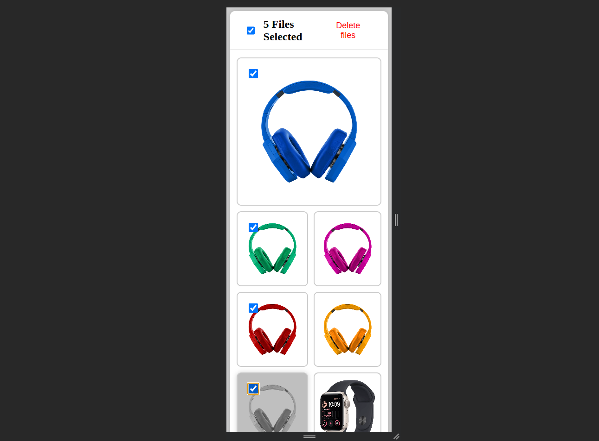

# React Image Gallery





<!-- live demo -->

[Live Demo](https://ig-kappa.vercel.app/)

## Table of Contents

- [Introduction](#introduction)
- [Features](#features)
- [Prerequisites](#prerequisites)
- [Installation](#installation)
- [Usage](#usage)
- [Deployment](#deployment)
- [Contributing](#contributing)
- [License](#license)

## Introduction

: A simple image gallery app built with React.js, CSS and Sortable.js

## Prerequisites

- Node.js (v14+)
  -Javascript
  -React.js
  -CSS
  -Sortable.js
  -Npm
-

## Installation

1. Clone the repository:

   ```bash
   git clone https://github.com/mamun-mahmood/image-gallery.git
   cd image-gallery
   ```

2. Install dependencies:

   ```bash
   npm install
   "if there's dependency conflict run"
   npm install -f
   ```

3. Run the application:

   ```bash
   npm run dev
   ```

## Usage

- Add images by clicking the add button (Not implemented yet)
- Drag and drop images to reorder
- Click on the image to view in full screen (Not implemented yet)
- Hover on the image to sleect image
- Click on the delete button to delete selected images

## Deployment

- Deployed on Vercel
- [Live Demo](https://ig-kappa.vercel.app/)

## Contributing

- Pull requests are welcome. For major changes, please open an issue first to discuss what you would like to change.
- Please make sure to update tests as appropriate.

## License

[MIT](https://choosealicense.com/licenses/mit/)
